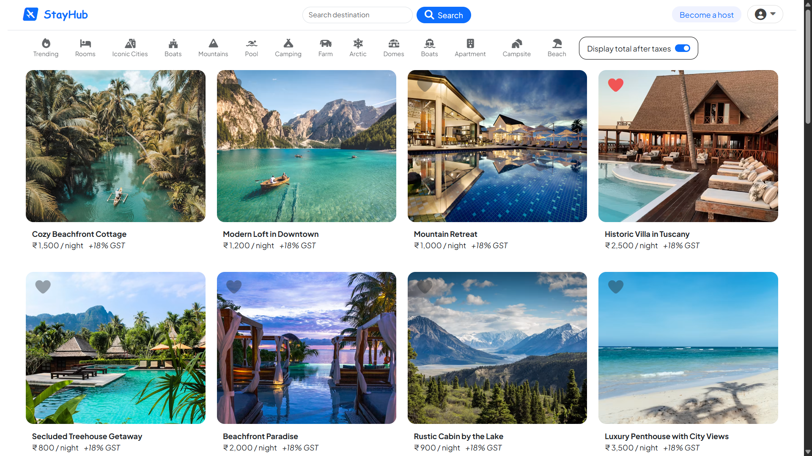
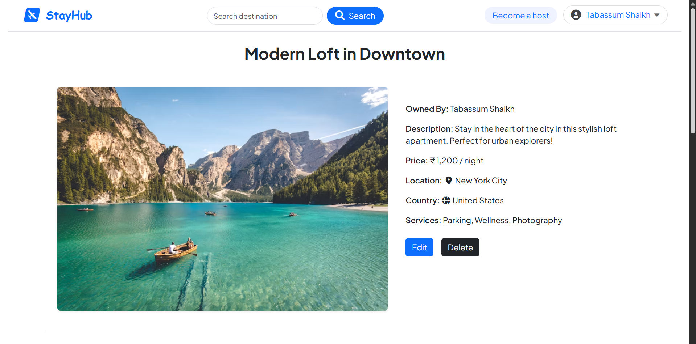
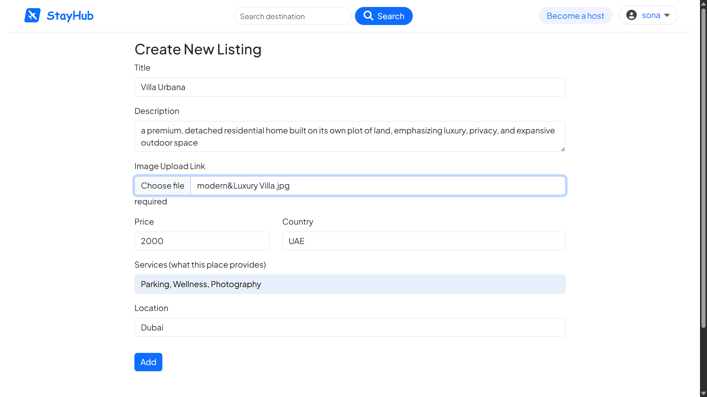
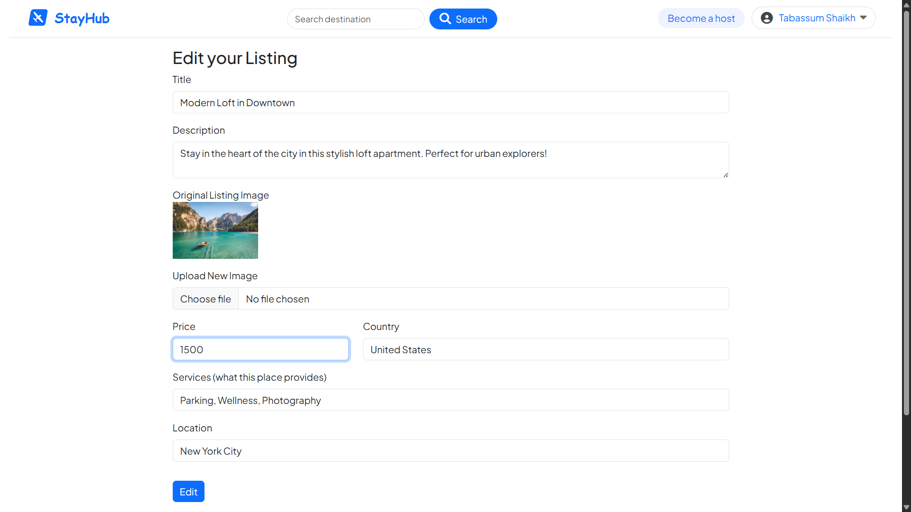
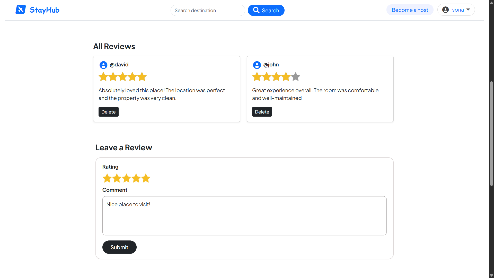
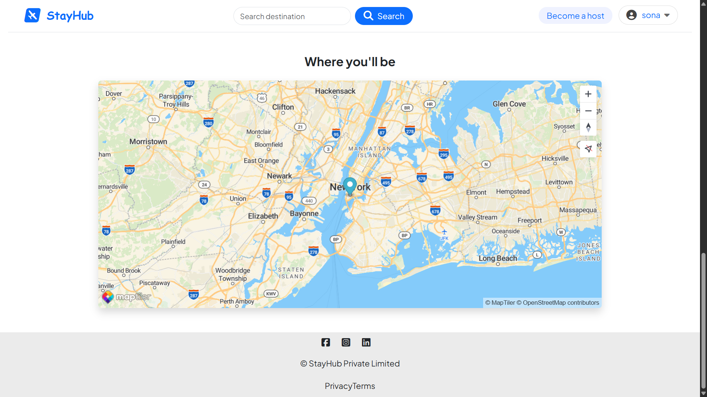
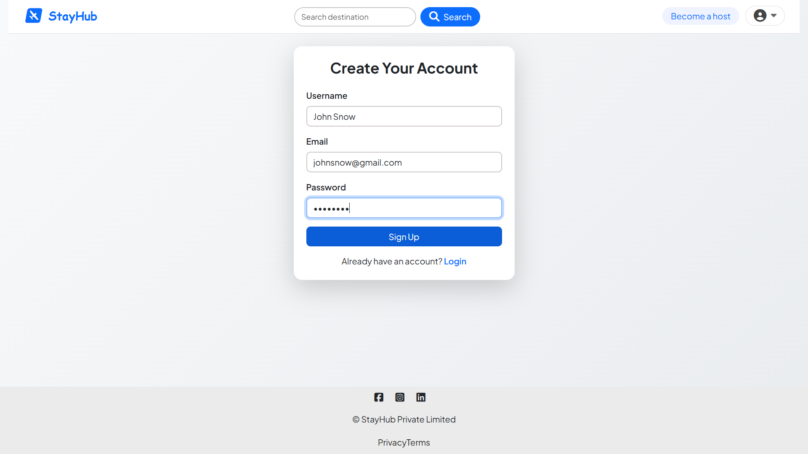
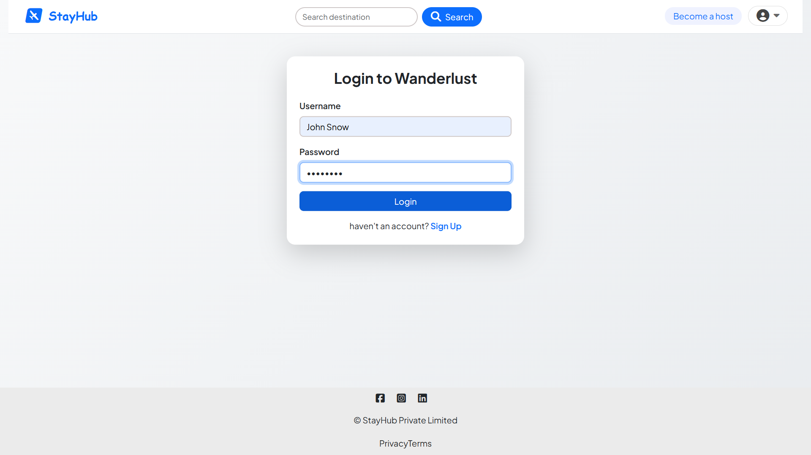

# StayHub

**Stayhub** is a full-stack web application inspired by **Airbnb**, allowing property owners to list and manage their properties while users can explore, book, and review them.  
It features full **authentication and authorization**, **property management**, **booking system**, and **review functionality** all within a modern, responsive UI.

---

## 1. Features

1. **Authentication & Authorization**
   - Secure user registration and login.
   - Password hashing for security.
   - Role-based access (Owner / User).

2. **Property Management**
   - Owners can add, edit, and delete their listings.
   - Each property includes images, title, location, description, and price.
   - Users can browse and search for properties by location, price, or amenities.

3. **Booking System**
   - Users can book properties for specific dates.
   - Prevents overlapping or duplicate bookings.
   - Users and owners can view their booking history.

4. **Reviews & Ratings**
   - Users can add, edit, and delete reviews.
   - Average rating displayed on each property page.
   - Helps users make informed booking decisions.

5. **Responsive Design**
   - Fully responsive layout for desktop, tablet, and mobile.
   - Optional dark and light theme support.

6. **Error Handling & Validation**
   - Robust input validation for all forms.
   - Centralized error handling for API routes..

---

## 2. Screenshots





<!--  -->







<!--  -->

---

## 3. Tech Stack

| Category            | Technology                    |
| ------------------- | ----------------------------- |
| **Frontend**        | HTML / CSS / JavaScript / EJS |
| **Backend**         | Node.js / Express.js          |
| **Database**        | MongoDB                       |
| **Authentication**  | JWT / Passport.js             |
| **Storage**         | Cloudinary / AWS S3           |
| **Deployment**      | Vercel / Render / Railway     |
| **Version Control** | Git & GitHub                  |

---

## 4. Installation and Setup

### Prerequisites

- Node.js (v16+)
- MongoDB (local or Atlas)
- Git

### Steps to Run Locally

1. **Clone the Repository**

   ```bash
   git clone https://github.com/TabassumSK/wonderlust.git
   cd wonderlust

   ```

2. Install Dependencies

   ```bash
   npm install

   ```

3. Run the Application
   ```bash
   npx nodemon app.js
   ```

---

## 5. Configure Environment Variables:

Create a `.env` file in the root directory. You will need to add your specific keys for the database, session, Cloudinary, and MapTiler. A typical `.env` might look like this:

```env
# Database
MONGO_URL=your_mongodb_connection_string

# Session Secret
SECRET=your_secret_key

# Cloudinary Setup
CLOUD_NAME=your_cloud_name
CLOUD_API_KEY=your_api_key
CLOUD_API_SECRET=your_api_secret

# MapTiler Setup
MAP_TOKEN=your_maptiler_token
```
